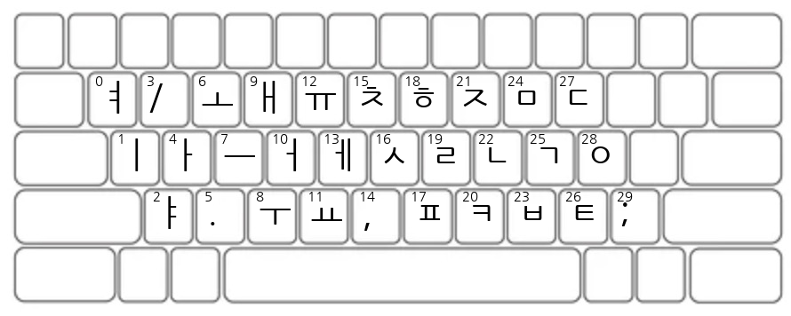

# 완벽한 키보드 만들기 (feat. 유전 알고리즘)

유전 알고리즘을 사용하여 손가락을 가장 조금 움직일 수 있는 완벽한 배치의 키보드를 만드는 프로젝트

> 유튜브 [빵형의 개발도상국](https://www.youtube.com/@bbanghyong)

## 데이터셋

AI허브 한국어 SNS 데이터셋

https://www.aihub.or.kr/aihubdata/data/view.do?dataSetSn=114

## 결과

### 8개 손가락 사용 (개인및관계)

### 8개 손가락 사용 (미용과건강)

### 2개 손가락 사용 (개인및관계)

스마트폰의 경우 엄지 2개 사용

## Reference

[Using AI to Create the Perfect Keyboard](https://www.youtube.com/watch?v=EOaPb9wrgDY)

## 제작지원

- [AI허브](https://www.aihub.or.kr/)
- [한국지능정보사회진흥원](https://www.nia.or.kr/)
